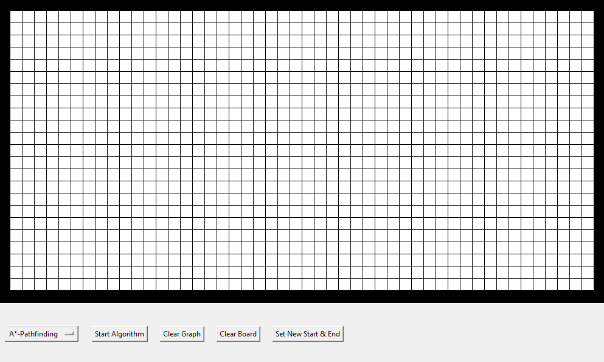

# Pathfinding Visualizer
## Preview

## Algorithms
The following algorithms are implemented to be visualized:
- **Breadth-first** (guarantees shortest path, unweighted graphs)
- **Depth-first** (does not guarantee shortest path, unweighted graphs)
- **Dijkstra** (guarantees shortest path, weighted graphs)
- **A\*** (guarantees shortest path, weighted graphs)

The A* algorithm is implemented with the Manhattan Distance as heuristic function (measures how far from the target the currently visited node is, given no barriers are drawn).

## Controls
**Left mouse button:** Draw with barriers so those nodes cannot be visited.\
**Right mouse button:** Delete barrier that was previously drawn.\
Note that you can also set a new start (green) and end (red) node as well as clearing only the drawing of the graph to see how other pathfinding algorithms will go past barriers to the end node. Alternatively you can clear the whole board (start and end node will stay).

## Requirements
- Python 3.x
- Tkinter library (comes built in with Python)